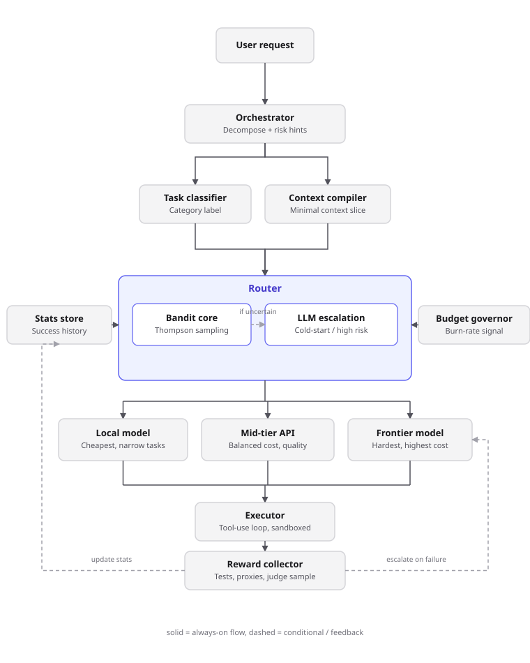

# Architecture

Token-Maxxing-Harness is an agentic coding harness with a custom model router: it decomposes a coding
task into subtasks and dispatches each one to whichever worker model is likely to complete it
correctly at the lowest cost, learning that assignment over time instead of hardcoding it.

## Pipeline

1. **Orchestrator** — decomposes the incoming request into a subtask DAG. Runs on a fixed, capable
   model (not itself routed) since a bad plan is a worse failure mode than a slow worker. Emits a
   lightweight risk/tier hint per subtask alongside the decomposition, piggybacked on the read it was
   already doing — this is the harness's only per-subtask LLM judgment, and it's free in the sense
   that the orchestrator was going to look at the task anyway.

   Decomposition itself is three phases: **triage** (cheap, no tools — decides whether the request
   even needs repo context, so "what is 1+1" never pays for exploration), **explore** (only if triage
   says so — reuses the same tool-use loop and read-only tools as any subtask, so the plan is grounded
   in real files instead of guessing at structure), then **structure** (turns the request, plus any
   exploration summary, into a validated subtask DAG). All DAG validation — cycles, unknown/self
   dependencies, duplicate ids — happens after the client returns a plan, not inside it; an invalid
   plan currently just fails rather than being repaired and retried.

   Once every subtask the orchestrator currently knows about has completed, the driving loop calls
   **replan** before declaring the run done: the orchestrator hands the client the original request,
   the subtasks already planned, and what actually got produced (each completed subtask's id,
   description, and a truncated summary of its final output), and asks whether the request still
   needs more work. "No further work needed" is a first-class, valid answer — an empty result there
   isn't a failure the way an empty result from the initial decomposition is — and is in fact the
   common case; new subtasks only come back when a completed output actually surfaced a gap the
   original plan missed. Any new subtasks are validated against the full existing+new graph (the same
   duplicate-id/unknown-or-self-dependency/cycle checks as the initial plan, just run against the
   merged subtask list) and merged into the tracked plan, which can unlock a further round of ready
   subtasks and another replan once those finish too.

   In a multi-turn session (`src/cli.ts`), decomposition also sees the session's prior turns
   (request + answer, most recent last), so triage/explore/structure can resolve a follow-up's
   vague references ("that file", "now do the same for the other one") into something concrete.
   This is the only place conversation history is used — it's resolved into a self-contained
   subtask description during structure, so a worker executing a subtask never sees the history
   itself, matching the context compiler's "narrow, not everything" philosophy below.

   Two things keep that history from growing into a cost problem of its own. First, triage also
   emits `worthRemembering`: whether this exchange is plausibly part of an ongoing thread versus a
   one-off aside (a quick unrelated lookup, trivial arithmetic) unlikely to be referenced again — the
   request still runs and gets answered regardless, this only controls whether the CLI appends it to
   the session's history afterward, so an unrelated tangent can't later confuse an "it"/"that" it
   has nothing to do with. Second, `formatConversationHistory()` uses two tiers rather than a single
   hard cutoff: the last 5 turns appear in full (request + truncated answer), the next 10 turns
   older than that get condensed, and anything older than both is genuinely dropped. A turn aging
   out of full detail still leaves a trace instead of vanishing outright.

   The condensed tier's mention is a real LLM summary, not just the bare request text: the first
   time a turn crosses from the recent into the condensed window, `src/cli.ts` runs it through
   `AnthropicConversationSummarizerClient` (`src/memory/`) — a cheap model (haiku by default, since
   compressing a turn that's about to leave full detail is exactly the low-stakes, high-volume task
   this harness's whole premise says shouldn't burn a strong one) — and caches the one-sentence
   result on the turn itself (`ConversationTurn.summary`), never recomputing it. This runs *after*
   the turn's own answer is already on screen, so it never delays what the user is waiting for, and
   it fails soft: if the summarization call errors, that turn just keeps using the plain request-text
   fallback for this render and gets retried the next time something ages out.
2. **Task classifier** — labels each subtask against a configurable category taxonomy (e.g.
   `trivial-lookup`, `small-edit`, `multi-file-refactor`, `test-authoring`, `exploration`). Cheap
   heuristics first, LLM fallback only when ambiguous, so classification itself doesn't burn budget.
3. **Context compiler** — slices the minimal context each worker actually needs (relevant files, the
   specific prior subtask outputs it depends on) instead of forwarding full conversation/repo state.
   Context volume is often a bigger cost lever than model choice.
4. **Router** — see below.
5. **Executor** — runs the tool-use loop against the chosen model. Tool permissions are tiered
   alongside model tiers (e.g. a still-unproven cheap model doesn't get unrestricted write/bash
   access on a risky category).
6. **Reward collector** — scores the outcome (see Reward signal below) and updates the stats store;
   failures/low-confidence results escalate to the next tier rather than just failing.

The orchestrator re-enters (via replan, above) after each batch of subtask results rather than
planning once and executing blindly — coding tasks routinely reveal new work mid-flight.

## Router

The router is a **hybrid**: a statistical bandit handles the default case, with LLM judgment
reserved for exactly the situations the bandit is bad at.

### Bandit core

Each `(task category, candidate model)` pair is an **arm**. Per-category granularity is the
starting point — coarse enough that each arm sees enough traffic to converge, fine enough that a
cheap model's 90% success rate on `trivial-lookup` doesn't get averaged against its 20% success
rate on `multi-file-refactor`. Finer granularity (e.g. splitting further by repo language) trades
decision resolution for convergence speed, and should only be added once there's evidence
category-alone routes wrong along that dimension.

Selection uses **Thompson sampling**: each arm maintains a `Beta(α, β)` posterior over its true
success rate (`α`/`β` incremented on success/failure, seeded from an optimistic prior per the
registry's declared capability tier). At decision time, draw one random sample from each candidate
arm's posterior and route to the highest draw. Arms with little data have wide posteriors, so they
occasionally win by chance even with a middling mean — that's exploration happening in proportion
to actual uncertainty, with no hand-tuned exploration rate, and it decays naturally as an arm
accumulates evidence.

Cost is folded in as `θ − λ·normalized_cost` at decision time (θ = the sampled quality belief, λ =
a weight the budget governor turns up as burn-rate rises). `normalized_cost` is each arm's cost
rescaled to `[0, 1]` relative to the cheapest and priciest candidate *within that category* —
without this, λ has no portable meaning: the same λ that meaningfully trades off a $0.001 vs $0.05
difference on a small edit would be almost inert on a category with 10x the token volume, since raw
dollar costs scale with category size. Normalizing keeps "does it work" (learned) cleanly separate
from "how much do we care about cost right now" (a dial that means the same thing everywhere),
rather than tangling both into one posterior.

Reward passed to an arm is a float in `[0, 1]`, not a bare success/fail boolean — this is what lets
the reward signal below (a blend of deterministic checks, proxies, and judge sampling) feed the
bandit directly instead of being collapsed to a boolean first and losing the graded signal.

Registering an arm is idempotent: re-registering an already-known `(category, model)` pair (e.g. on
every config reload) refreshes its cost but leaves learned `alpha`/`beta` untouched. Deliberately
discarding history (e.g. after a known model version swap) goes through a separate `resetArm()`
call, so a routine config reload can never silently erase weeks of learned routing behavior.

Learned state persists across runs (`src/persistence/`) — `getAllArms()`/`restoreArm()` snapshot and
restore full arm state (not just the summary stats `getCandidates()` exposes) to/from SQLite via
Node's built-in `node:sqlite` (no dependency needed, though it's a Node-experimental API as of this
writing). The router itself stays storage-agnostic; persistence is a separate layer built on top,
not baked into `Router`/`Arm`.

### LLM escalation

Invoked only when the bandit's sampled arms are still highly uncertain (new/low-traffic category)
or the orchestrator flagged the subtask as high-risk. Reads the actual task description rather than
a bucketed label, and can be handed the current stats table as context. Kept rare deliberately: an
LLM call in the routing hot path costs tokens and adds latency on every use, which fights the
harness's core goal if it becomes the default path instead of the exception.

### Budget governor

Tracks spend *and* burn-rate (tokens/min, not just a cumulative cap). Rising burn-rate increases λ
above, biasing routing toward cheaper arms without overriding the classifier or bypassing the
bandit's learned quality beliefs. `recordSpend()` is cache-aware: it's given the same
input/output/cache-read/cache-write breakdown described under Prompt caching below and bills
cache-read tokens at a fraction of a fresh input token's weight (and cache-write tokens at a
premium), so burn-rate tracks real spend rather than raw token volume -- otherwise a call that hit
a full cache read would count as if it cost the same as a completely fresh one, and caching would
never show up as the harness actually getting cheaper. Wired into `SubtaskRunner` (`src/runner/`)
as of the router-to-cost work below: each attempt asks the governor for the current costWeight
before routing and reports its real usage back afterward, and `cli.ts`/`demo-real.ts`/
`stress-test.ts` all construct one shared instance per run. Previously this component existed and
was tested but nothing in the real pipeline ever called it, so costWeight was permanently 0 in
every real run regardless of actual spend.

## Reward signal

The bandit's guarantees only hold if "success" is a trustworthy signal, so reward blends three
tiers by trust:

1. **Deterministic** (highest weight) — tests pass, lint clean, diff applies, no exception thrown.
2. **Cheap proxy** (medium weight) — retry count, tool-call sanity, output schema validity.
3. **Judge sampling** (low frequency, high cost) — periodically send output to a stronger model or
   the user for pass/fail, used to calibrate that (1) and (2) actually track real quality rather than
   optimizing for "passed lint" while quality silently drifts. Deliberately scoped to "did the trace
   show the task getting done," never "is this code correct" — asking an LLM to eyeball code for bugs
   without executing it produces confident, plausible-sounding false positives (that's tier 1's job,
   and it's more reliable at it); see `src/reward/judge-rubric.ts` for the rubric and the incident that
   shaped it. Every judge verdict must cite literal evidence from the trace, and low-confidence
   verdicts are damped toward neutral rather than allowed to swing the reward on a guess.

Each arm discounts its own accumulated evidence back toward its prior on every update (default
decay 0.995, ~140-pull half-life), so a regression or improvement is reflected within a bounded
number of pulls instead of requiring an ever-growing number of contradicting observations to move
the posterior. This decay is per-pull, not wall-clock — an arm that stops being used at all simply
keeps its last belief, which is the correct behavior (nothing contradicted it) but means a model
that quietly gets replaced upstream without ever failing won't be caught by decay alone; that's what
`resetArm()` and judge sampling are for. A manual `resetArm()` is available for when a model version
is known to have changed.

## Multi-provider model registry

Workers are config-driven entries — `{provider, model_id, cost per token, capability tier, context
limit}` — behind a unified call interface, so adding a new model (local, another API provider, or
Anthropic) is a registry entry, not new routing code. `src/registry/` (`ModelRegistry`,
`seedRouterFromRegistry`) provides this metadata layer, but `cli.ts`/`demo-real.ts`/`stress-test.ts`
don't source their bandit arms from it yet -- they register two hardcoded Anthropic model ids
directly. What those three *do* now have is `ModelClientFactory`
(`src/executor/anthropic-model-client-factory.ts`): `SubtaskRunner.attempt()` resolves the router's
`decision.modelId` to a real client through it on every attempt, so the routing decision actually
determines what executes. Before this, `SubtaskRunner` ran every subtask against one client fixed
at construction time regardless of what the bandit or escalation path chose -- `decision.modelId`
only ever reached `reportOutcome()`'s bookkeeping, so every run was really testing "can this one
model solve it," not whether routing helped. Verified live: a trivial request correctly stayed on
the cheap tier (the escalation client itself judged the stronger model unnecessary), and a
genuinely harder one escalated to and executed against the stronger model for real, producing
visibly more sophisticated output than the cheap tier would. `ModelClientFactory` is still
Anthropic-only, so the multi-provider half of this section (a real second `provider` in the
registry, a factory that dispatches across providers, arms actually seeded from `ModelRegistry`)
remains open.

## Prompt caching

Every real Anthropic-backed client now marks its system prompt with an ephemeral cache breakpoint
(`src/executor/prompt-caching.ts`: `cachedSystemPrompt`), and `AnthropicModelClient` additionally
marks the last tool definition and the last message of each turn's conversation array
(`withCacheBreakpointOnLastMessage`) -- the same incremental-caching pattern a real agent loop
(e.g. Claude Code's own) relies on: each new turn in `Executor.run()`'s tool-use loop reads
everything up through the *previous* turn's marked message back at the cheap cache-read rate and
pays full price only for what's newly appended since then, instead of re-paying for the whole
growing conversation on every single turn.

**Verified live against the real API, with an honest caveat about when it actually engages.**
A synthetic long system prompt confirmed the mechanism itself is correct end to end: call 1 wrote
8,402 tokens to cache (`cache_creation_input_tokens`), call 2 read them back
(`cache_read_input_tokens`) instead of paying full input price again. But Anthropic enforces a
*minimum* cacheable prompt length -- 1024 tokens for Sonnet/Opus-class models, a stricter 2048 for
Haiku-class -- and this harness's actual system prompts are short, single-paragraph instructions.
Measuring the real system prompt + all 5 real tool schemas together (~1.6K tokens): on
`claude-sonnet-5` this clears the 1024 minimum and caches correctly from turn 1 (confirmed:
`cache_creation_input_tokens` on turn 1, `cache_read_input_tokens` on turn 2). On
`claude-haiku-4-5` -- the default/cheap tier most subtasks actually route to -- the same prefix
stays under the stricter 2048 minimum on early turns, so caching doesn't engage until a subtask's
conversation grows large enough on its own (e.g. after reading a substantial file). This isn't a
bug in the implementation; it's a real constraint of the underlying caching system, and it means
the realized savings are currently concentrated in escalated/stronger-tier calls and longer
tool-use loops, not the average short cheap-tier subtask. Lengthening the shared system prompts or
tool descriptions to deliberately clear Haiku's threshold is a plausible follow-up, not attempted
here since it would mean padding real content with tokens that exist only to unlock caching.

**Extended (1-hour) TTL.** Every breakpoint above used Anthropic's default 5-minute ephemeral TTL,
which is short relative to a real run: classification, routing, tool-use turns, and reward scoring
all happen between one subtask's calls and the next, and a multi-subtask run or benchmark pilot
routinely spans well over 5 minutes end to end. A cache write that lapses before the next read
arrives is pure waste -- it paid the write premium for nothing. `cachedSystemPrompt()`
(`src/executor/prompt-caching.ts`) now defaults to the 1-hour TTL, and the executor's "last tool
definition" breakpoint (`EPHEMERAL_CACHE_CONTROL_LONG`) does too, since both are byte-identical
across every subtask for the life of a whole run rather than rolling forward turn by turn. The
rolling "last message" breakpoint (`withCacheBreakpointOnLastMessage`) deliberately keeps the
default 5-minute TTL: it's superseded by a new marked message on every turn, so it's read at most a
couple of times before moving on, and paying the larger 1-hour write premium there would be pure
loss with no offsetting reads. This is a genuinely free win, not a workaround for the Haiku minimum
above -- it doesn't add a single token, it just stops throwing away cache writes that a real run's
own pacing was already discarding before they paid off.

**Cache-aware cost accounting.** Before this, a call's cache read/write breakdown was discarded the
moment `AnthropicModelClient.generate()` returned -- `GenerateResult.usage` only carried
`inputTokens`/`outputTokens`. `TokenUsage` (`src/executor/types.ts`) now also carries
`cacheReadTokens`/`cacheWriteTokens` (read from the AI SDK's own `usage.inputTokenDetails`, which
already separates a cache read/write out of the total), `Executor.run()` aggregates them across
turns like the other two fields, and `BudgetGovernor.recordSpend()` (see Budget governor above)
uses them to bill real spend instead of raw token counts. Without this, caching's savings were
real on Anthropic's invoice but invisible to the harness itself.

## Open design questions

- **Provider abstraction**: the single-provider version of this is done -- `ModelClientFactory`
  (see Multi-provider model registry above) turns a router decision into the real Anthropic client
  that executes it. What's still open is multi-*provider*: build that call layer directly, or sit
  on top of an existing library (e.g. litellm) and only own the registry/router/bandit logic on top.
- **Hierarchical priors**: a low-traffic category currently starts from a flat optimistic prior;
  sharing a prior derived from global cross-category stats would reduce cold-start pain without
  exploding arm granularity.
- **Contextual features**: if per-category routing proves too coarse along a specific dimension
  (language, file size), promote it to an explicit bandit context feature rather than adding it
  speculatively.
- **Escalation cost modeling: implemented.** `CategoryRouter.select()` (`src/router/bandit.ts`) now
  scores each arm on `cost + P(fail) * escalationCost`, not raw `cost` alone -- `P(fail)` is
  `1 - meanSuccessRate` (the arm's stable decayed estimate, not the same Thompson draw used for the
  quality term, so cost stays a deterministic function of accumulated evidence rather than
  inheriting the exploration term's sampling noise) and `escalationCost` approximates
  `SubtaskRunner`'s forced-escalation retry as the category's priciest candidate, since
  `AnthropicEscalationClient` is explicitly steered toward a stronger model on a forced escalation,
  not a random one. This is still an approximation -- the escalation client can in principle choose
  any candidate, not always the priciest -- but it directly fixes the previously-flagged gap: two
  arms priced identically but with very different failure rates used to score identically on cost;
  now the flaky one's true expected cost (retries included) is scored much closer to the category's
  strongest arm. The whole cost term was also dead in every real run until now regardless of this
  fix, since nothing ever passed a nonzero `costWeight` -- see Budget governor above for the wiring
  that makes it live.
- **`read_file` offset/limit**: implemented. Optional 1-indexed `offset` and `limit` args select a
  specific line range instead of defaulting to the head of the file; `maxBytes` truncation still
  applies as a safety net on top of whatever range is selected, and an `offset` past the end of
  the file returns empty content rather than an error (a legitimate no-op, not a security
  concern). Omitting both args reproduces the original whole-file-up-to-maxBytes behavior exactly.
- **`write_file` auto-created parent directories**: implemented as an opt-in `createParents`
  constructor option (default `false`, matching the original "reject rather than guess"
  behavior). When enabled and the immediate parent is missing, the tool walks up to the deepest
  ancestor that currently exists, `realpath`s *that* to confirm it's genuinely within the
  workspace root, and only then creates the missing segments with `fs.mkdir(dir, { recursive:
  true })` — so a symlink further up the (partially nonexistent) path still can't be used to
  escape the workspace just because the specific target's parent didn't technically exist yet.
- **`write_file` against the real repo is now gated, not just sandboxed**: `demo-real.ts` and
  `stress-test.ts` both wire it up scoped to `process.cwd()` (the actual project, not a scratch
  dir) with `onBeforeWrite` set to `interactiveWriteApprovalGate`
  (`src/tools/write-approval-gate.ts`) — every pending write prints the path, whether it's a new
  file or an overwrite, and the full before/after content to the terminal, then blocks on stdin
  for an explicit y/yes, defaulting to refuse on anything else. This is a human-in-the-loop gate
  sized for interactive demo/stress runs; an unattended real-repo run would need a different one
  (allowlist rules, diff-size limits) since there's no human to answer the prompt.
- **`delete_file` is still not built**: `write_file`'s denylist/containment/approval-hook pattern
  is the template if/when it is; deletion is its own risk category (irreversible), not just
  "write_file but more so."
- **A real shell/command tool now exists (`run_command`, `src/tools/run-command.ts`)**: the gap
  that let a model declare a task "done" without ever running the code it wrote or the tests
  meant to check it -- a benchmark pilot run against SWE-bench Lite surfaced three unresolved
  instances that traced directly back to this: reward being structurally blind to correctness
  because nothing could execute anything. Deliberately shaped like a real Bash tool (arbitrary
  command, not a narrow test-runner allowlist) rather than a narrower "safer" allowlist -- this
  is a genuinely different risk category from read/list/write/edit, which are contained by
  realpath-based path checks that make escaping the workspace structurally impossible. A shell
  command can't be contained that way; the cwd is pinned to the workspace root and a short
  denylist catches unambiguously destructive patterns (`sudo`, `rm -rf /`, a fork bomb, `dd` to a
  raw device), but neither is a real security boundary the way path containment is. Real isolation
  has to come from how the caller runs this (a disposable per-instance checkout, nothing sensitive
  reachable from the process), not from anything the tool itself does. Same interactive-approval
  pattern as `write_file` in `cli.ts`/`demo-real.ts`/`stress-test.ts`; `run-instance.ts` (the
  benchmark harness) omits the approval hook the same way it already omits `write_file`'s, since
  an unattended run has no human to ask.
- **`edit_file` (`src/tools/edit-file.ts`), a targeted search-replace tool**: `write_file`
  requires the entire file's content on every call, so a small requested change to a large file
  means the model has to faithfully reproduce every other line untouched -- the same pilot run
  had a case where that reproduction silently failed on a cheap model and collapsed a 2,328-line
  file to 3, deleting several class definitions the hidden test suite then failed to even import.
  `edit_file` takes `old_string`/`new_string` instead of full content (plain search-replace,
  matching Claude Code's own Edit tool -- a diff format's line numbers and hunk headers are
  exactly the kind of thing a weaker model gets subtly wrong). `old_string` must match exactly
  once in the file; zero or multiple matches are rejected rather than guessed at, since a wrong
  guess here is the same silent-corruption failure shape this tool exists to prevent. Same
  containment/denylist/approval-hook shape as `write_file`.
